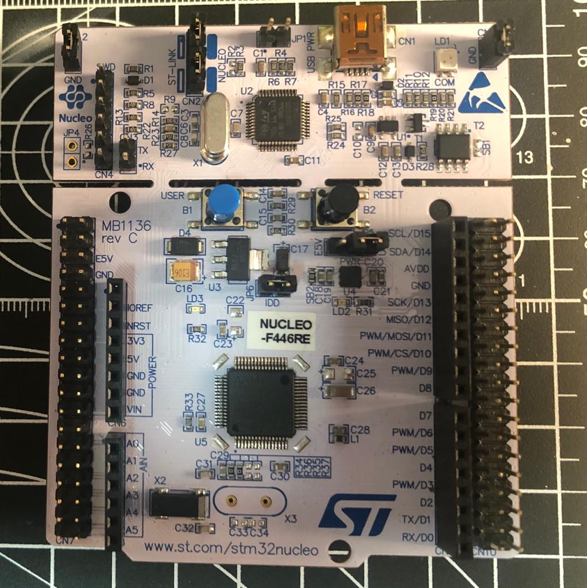
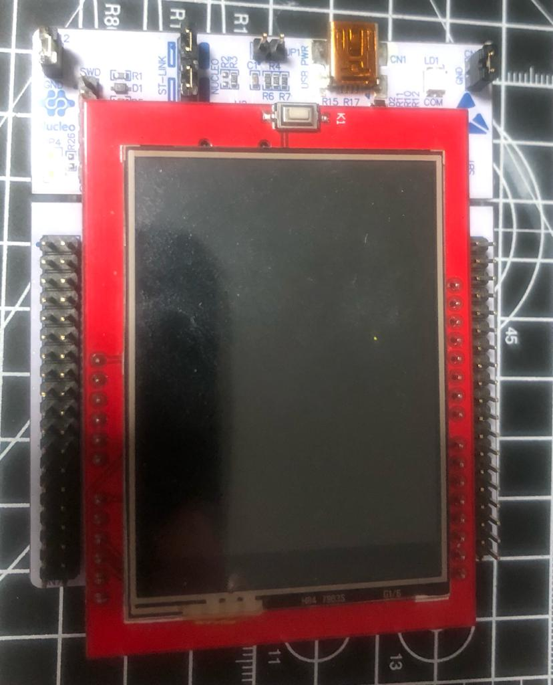

#Osciloscopio

Projeto realizado pelos alunos do curso de Sistemas Embarcados do Senai para a disciplina de Projeto de Sistemas Embarcados

# Introdução

Esse projeto foi feito utilizando para processadores ARM e no caso do projeto, foi utilizado um ARM M4. Para o projeto específico, foi utlizado uma das placas Nucelo da ST a **NUCLEO-F446RE** [Link no Site do Fabricante](https://www.st.com/en/evaluation-tools/nucleo-f446re.html)

# Pre Requisitos para o projeto

## Pre Requisitos para o projeto - Software

- **fonts.h:** Biblioteca de fontes para exibição de gráficos no display TFT
- **tft.h:** Biblioteca para escrita de valores no display TFT
- **user_setting.h:** Biblioteca para escrita de valores no display TFT
- **functions.h:** Biblioteca para escrita de valores no display TFT
- **arm_math.h:** Para geração de séries de Fourier para análise de frequência
- **arm_const_structs.h:** Para geração de séries de Fourier para análise de frequência
- **math.h:** Será necessário para trabalhar com valores numéricos

## Pre Requisitos para o projeto - Hardware

Placa Nucleo F446RE

Display TFT 2.4"

Jumper

3 botões PCB

Protoboard

