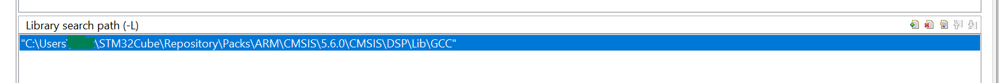

# Osciloscopio - STM32

Um pequeno, simples, porém singelo osciloscopio.

### Sumário
**[Introdução](#Introdução)** 
**[Funcionalidades atuais e suporte a leituras](#Funcionalidades atual e suporte a leituras)** 
**[Pre Requisitos para o projeto](#Pre Requisitos para o projeto)** 
**[Erros Conhecidos](#Erros Conhecidos)** 
**[Créditos](#Créditos)** 

# Introdução

Projeto realizado pelos alunos do curso de *Sistemas Embarcados do Senai (Turma 8)* para a disciplina de *Projeto de Sistemas Embarcados*. Esse projeto foi feito para processadores ARM e no caso do projeto, foi utilizado um ARM M4. Para o projeto específico, foi utilizado uma das placas Nucelo da ST a **NUCLEO-F446RE** [Link no Site do Fabricante](https://www.st.com/en/evaluation-tools/nucleo-f446re.html)

# Funcionalidades atual e suporte a leituras

1. Leitura de tensão DC até 24v
2. Geração de Frequencia Dominante a partir do uso da biblioteca DSP da Arm
3. Função "Trigger" para congelar a leitura em Tela
4. Ajuste de escala de leitura
5. Geração de um GND para referência
6. Geração de frequencia de 500hz e 1Khz

# Pre Requisitos para o projeto

Abaixo falamos um pouco do que você vai precisar de Hardware e software para rodar esse projeto.

## Pre Requisitos para o projeto - Hardware

- **Placa Nucleo F446RE:** Microcontrolado utilizada durante o projeto. 

No arquivo **Readme.md** ([Disponível aqui](https://github.com/caiotmello/Osciloscopio/tree/master/Core/Src)) na pasta **main** você encontra as informações como as portas utilizadas, configuração usada no arquivo **OSCILOSCOPIO.ioc** e outras definições importantes sobre como configurar sua interface. Do jeito que o projeto está no GIT, a configuração já foi feita e não precisa ser refeita, porém caso por alguma questão de importação não ocorra o mapeamento correto das portas, vamos discutir as principais configurações do CubeMX nesse arquivo também. 

- **Display TFT 2.4":** Display utlizado para exibição das funções

- **Jumper:** Utilizado para ligação dos botões das funções do osciloscopio ao microcontrolador.
- **3 botões PCB:** Botões PCB criados para navegar nas funções do Menu do Osciloscopio.
- **Protoboard**: Conectar os jumpers, botões e pontas da prova a placa.
- **Resistores**: 
- **Cabo USB**: Para carregar o programa e conectar a placa ao computador. Para referencia, o cabo USB deve ter em uma ponta uma saída do tipo *USB-A* e na outra uma saída do tipo *MINI-USB* (Esta é similar ao cabo de carga do controle do PS3). **Importante mencionar que ao adquirir a placa da ST, a mesma não vem com esse cabo, ele deve ser adquirido a parte.** Além disso, também é possível carregar a placa da ST utilizando o ST-LINK caso você tenha, porém para esse projeto não utilizamos o ST-LINK.

## Pre Requisitos para o projeto - Software

- Para compilação de código, foi utilizado o **STM32CubeIDE** que pode ser baixado no site da ST [Link Oficial](https://www.st.com/en/development-tools/stm32cubeide.html#overview). Navegue até o final da página, selecione a versão para o seu sistema operacional e clique no botão "Get Software" respectivo para sua versão. **Esse programa foi testado para as versões 1.3.0 e 1.5.0**. O CubeIDE é baseado na IDE Eclipse, portanto, permite integração com as outras ferramentas do Eclips e Plugins, como Git.
- Baixar a biblioteca de DSP da Arm que pode ser encontrada em [Aqui](https://www.keil.com/pack/doc/CMSIS/DSP/html/index.html) 

# Erros Conhecidos

## Erro da Biblioteca DSP da Arm

Da forma que o projeto está atualmente, ele referencia a biblioteca de DSP da Arm de forma local, para isso, antes de compilar o projeto ajustar no caminho no Eclipse e referenciar a pasta local no seu computador para poder compilar. Seguir os passos a seguir:

1. Para isso, clicar com botão direito no nome do Projeto no Eclipse e clicar em "Properties"
2. Depois, navegar no seguinte caminho **C/C++ Build -> Settings -> MCU GCC Linker -> Library Search Path (-L)**
3. O caminho a alterar deve ficar da seguinte forma: 

4. Resolvido isso, a compilação ocorre com sucesso!

## Erro da pasta CMSIS sendo gerada automaticamente

No meu caso, devido a forma como eu configurei a biblioteca da ARM de DSP, ele gerava uma pasta CMSIS automaticamente toda vez que eu faço uma alteração no arquivo *ioc* de configuração. Para resolver isso, só remover a pasta CMSIS gerada, e a compilação ocorre normalmente. Existe uma opção que também pode ser de excluir essa pasta toda vez que for fazer o Build do projeto.

# Créditos

Creditos para o time que ajudou a fazer esse projeto realidade! Caio, Willian, Renan, Luiz, Alberto, Rafael, Andre e ao nosso professor Leandro por toda ajuda!!
